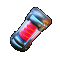
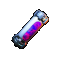
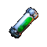

[//]: # (🔴 red)

[//]: # (🟣 purple)

[//]: # (🟢 green)

[//]: # (🟡 yellow)

[//]: # (🔵 blue)

# POCKET FACTORY

During this event, all battle items have a chance of not being consumed after use.
In Rare difficulty, this chance is 80%, in Epic 70% and in Legendary 50%.

In each stage, monsters of a specific element will gain an Element Barrier,
which reflects all damage and status effects from their own element.

## RARE

| Stage | Reflect | ⚡ |     Monsters     | Boss                                         |           🗡️            |           🛡️            |             ❤️              |
|:-----:|:-------:|:-:|:----------------:|----------------------------------------------|:------------------------:|:------------------------:|:---------------------------:|
|   1   |   🟣    | 2 | 🟣&nbsp;&nbsp;🟢 | 🔵 DORIAN                                    |           468            |           ️342           |            ️1658            |
|   2   |   🟢    | 2 | 🔵&nbsp;&nbsp;🟢 | 🟡 JONATHAN   🔴 BLAZE                    |      819   ️812       |      ️468   ️464      |      ️2272   ️2254       |
|   3   |   🔵    | 3 | 🔵&nbsp;&nbsp;🟡 | 🔴 BLAZE   🟣 CELESTE                     |      ️798   ️835      |     ️476   ️️498      |      ️2312   ️2422       |
|   4   |   🟡    | 3 | 🟡&nbsp;&nbsp;🔴 | 🟣 CELESTE   🟢 AZUREBIND                 |      ️590   559       |      ️430   ️408      |      ️2087   ️1980       |
|   5   |   🔴    | 4 | 🔴&nbsp;&nbsp;🟣 | 🟢 AZUREBIND   🔵 DORIAN                  |      ️1002   954      |     ️599   ️️570      |      ️2907   ️2766       |
|   6   |   🔵    | 4 | 🔵&nbsp;&nbsp;🟢 | 🔴 BLAZE   🟡 JONATHAN   🟣 CELESTE    | ️749   ️738   ️749 | ️579   ️570   ️607 | ️2809   ️2767   ️2947 |
|   7   |   🔴    | 5 | 🔴&nbsp;&nbsp;🟡 | 🟢 AZUREBIND   🟣 CELESTE   🔵 DORIAN  | 1001   1035   1031 |  657   679   676   |  3192   3298   3286   |
|   8   |   🟣    | 5 | 🟣&nbsp;&nbsp;🔴 | 🔵 DORIAN   🟢 AZUREBIND   🟡 JONATHAN |  928   974   928   |  609   639   609   |  2959   3105   2957   |
|   9   |   🟢    | 6 | 🟢&nbsp;&nbsp;🟣 | 🟡 JONATHAN   🔵 DORIAN   🔴 BLAZE     |  979   987   978   |  643   648   642   |  3120   3145   3115   |
|  10   |   🟡    | 6 | 🟡&nbsp;&nbsp;🔵 | 🟣 CELESTE   🔴 BLAZE   🟢 AZUREBIND   | 1207   1148   1145 |  792   753   752   |  3847   3160   3650   |

### HERO LEGEND

| Name         | Image                                  | Skill                                                                                                                          |
|--------------|----------------------------------------|--------------------------------------------------------------------------------------------------------------------------------|
| 🔵 DORIAN    |        | ● Deals 269% damage to the target.   ● Applies Fragile to them for 6 turns   ● Fragile: Gains -22% defence               |
| 🟡 JONATHAN  |    | ● Deals 269% damage to the target.   ● Applies Blind to them for 4 turns   ● Blind: Gains -23% accuracy                  |
| 🔴 BLAZE     |          | ● Deals 249% damage to the target.   ● Reduces their energy by -25%                                                         |
| 🟣 CELESTE   |      | ● Deals 204% damage to the target.   ● All allies heal for 12% of the damage dealt.                                         |
| 🟢 AZUREBIND |  | ● Applies Sustained Might to all allies for 5 turns.   ● Sustained Might: Gains 33% attack, and extra 10% attack each turn. |

### REWARDS

|                        25x                        |                      25x                      |                         1x                          |                 30x                  |                        1x                         |                         1x                          |
|:-------------------------------------------------:|:---------------------------------------------:|:---------------------------------------------------:|:------------------------------------:|:-------------------------------------------------:|:---------------------------------------------------:|
|  |  |  |  |  |  |

## EPIC

| Stage | Reflect | ⚡ |     Monsters     | Boss                                           |           🗡️            |           🛡️            |            ❤️            |
|:-----:|:-------:|:-:|:----------------:|------------------------------------------------|:------------------------:|:------------------------:|:------------------------:|
|   1   |   🟣    | 3 | 🟣&nbsp;&nbsp;🟢 | 🔵 CRYSTAL                                     |           1166           |           765            |           3716           |
|   2   |   🟢    | 3 | 🔵&nbsp;&nbsp;🟢 | 🟡 THALOR   🔴 PYRO                         |      1366   1421      |       896   933       |      4351   4529      |
|   3   |   🔵    | 4 | 🔵&nbsp;&nbsp;🟡 | 🔴 PYRO   🟣 TENERBIS                       |      1496   1403      |       981   920       |      4768   4471      |
|   4   |   🟡    | 4 | 🟡&nbsp;&nbsp;🔴 | 🟣 TENERBIS   🟢 VERDANTRON                 |      972   1021       |       751   789       |      3674   3831      |
|   5   |   🔴    | 5 | 🔴&nbsp;&nbsp;🟣 | 🟢 VERDANTRON   🔵 CRYSTAL                  |      1439   1389      |      1050   1031      |      5096   4919      |
|   6   |   🔵    | 5 | 🔵&nbsp;&nbsp;🟢 | 🔴 PYRO   🟡 THALOR   🟣 TENERBIS        | 1386   1499   1402 |  910   984   958   | 4420   4479   4471 |
|   7   |   🔴    | 6 | 🔴&nbsp;&nbsp;🟡 | 🟢 VERDANTRON   🟣 TENERBIS   🔵 CRYSTAL | 2285   2343   2280 | 1249   1281   1247 | 6068   6223   6055 |
|   8   |   🟣    | 6 | 🟣&nbsp;&nbsp;🔴 | 🔵 CRYSTAL   🟢 VERDANTRON   🟡 THALOR   | 1476   1514   1473 | 1076   1104   1074 | 5228   5361   5216 |
|   9   |   🟢    | 7 | 🟢&nbsp;&nbsp;🟣 | 🟡 THALOR   🔵 CRYSTAL   🔴 PYRO         | 1526   1480   1581 | 1114   1080   1154 | 5407   5242   5602 |
|  10   |   🟡    | 7 | 🟡&nbsp;&nbsp;🔵 | 🟣 TENERBIS   🔴 PYRO   🟢 VERDANTRON    | 2514   2454   2499 | 1500   1464   1491 | 7286   7112   7244 |

### HERO LEGEND

| Name          | Image                                    | Skill                                                                                                                                                                             |
|---------------|------------------------------------------|-----------------------------------------------------------------------------------------------------------------------------------------------------------------------------------|
| 🔵 CRYSTAL    |        | ● Deals 314% damage to the target.   ● Dispels all buffs from all enemies.                                                                                                     |
| 🔴 PYRO       |              | ● Deals 149% damage to all enemies.   ● Applies Burn to them for 6 turns   ● Burn: Takes a total of 34% of caster's base attack as damage over turns.                       |
| 🟡 THALOR     |          | ● Deals 284% damage to the target.   ● Reduces their energy by -25%.                                                                                                           |
| 🟣 TENERBIS   |      | ● Deals 264% damage to the target and minor damage to nearby enemies.   ● Applies Fragile to them for 6 turns.   ● Fragile: Gains -22% defence.                             |
| 🟢 VERDANTRON |  | ● Deals 314% damage to the target.   ● Applies Ability Weaken to them for 3 turns.   ● Dispels all buffs from all enemies.   ● Ability Weaken: Gains -6% ability attack. |

### REWARDS

|                       50x                       |                        50x                        |                         2x                          |                 50x                  |                              1x                               |                         1x                          |                           1x                            |
|:-----------------------------------------------:|:-------------------------------------------------:|:---------------------------------------------------:|:------------------------------------:|:-------------------------------------------------------------:|:---------------------------------------------------:|:-------------------------------------------------------:|
|  |  |  |  |  |  |  |

## LEGENDARY

| Stage | Reflect | ⚡ |     Monsters     | Boss                                        |           🗡️            |           🛡️            |            ❤️            |
|:-----:|:-------:|:-:|:----------------:|---------------------------------------------|:------------------------:|:------------------------:|:------------------------:|
|   1   |   🟣    | 4 | 🟣&nbsp;&nbsp;🟢 | 🔵 FROSTBANE                                |           1383           |           907            |           4406           |
|   2   |   🟢    | 4 | 🔵&nbsp;&nbsp;🟢 | 🟡 GLORIVA   🔴 VULCAN                   |      1963   1803      |      1121   1030      |      5444   5001      |
|   3   |   🔵    | 5 | 🔵&nbsp;&nbsp;🟡 | 🔴 VULCAN   🟣 MORGANA                   |      1956   1905      |      1117   1088      |      5421   5281      |
|   4   |   🟡    | 5 | 🟡&nbsp;&nbsp;🔴 | 🟣 MORGANA   🟢 LINDEN                   |      1444   1409      |      1115   1088      |      5417   5287      |
|   5   |   🔴    | 6 | 🔴&nbsp;&nbsp;🟣 | 🟢 LINDEN   🔵 FROSTBANE                 |      1929   1964      |      1266   1289      |      6147   6260      |
|   6   |   🔵    | 6 | 🔵&nbsp;&nbsp;🟢 | 🔴 VULCAN   🟡 GLORIVA   🟣 MORGANA   | 1599   1548   1619 | 1235   1196   1251 | 6000   5806   6073 |
|   7   |   🔴    | 7 | 🔴&nbsp;&nbsp;🟡 | 🟢 LINDEN   🟣 MORGANA   🔵 FROSTBANE | 2858   2681   2704 | 1390   1304   1315 | 6751   6333   6386 |
|   8   |   🟣    | 7 | 🟣&nbsp;&nbsp;🔴 | 🔵 FROSTBANE   🟢 LINDEN   🟡 GLORIVA | 1967   1867   1971 | 1359   1290   1362 | 6599   6264   6615 |
|   9   |   🟢    | 8 | 🟢&nbsp;&nbsp;🟣 | 🟡 GLORIVA   🔵 FROSTBANE   🔴 VULCAN | 2253   2237   2087 | 1479   1468   1370 | 7182   7132   2087 |
|  10   |   🟡    | 8 | 🟡&nbsp;&nbsp;🔵 | 🟣 MORGANA   🔴 VULCAN   🟢 LINDEN    | 2751   2642   2652 | 1642   1576   1583 | 7976   7657   7687 |

### HERO LEGEND

| Name         | Image                                  | Skill                                                                                                                                                                                                                                                 |
|--------------|----------------------------------------|-------------------------------------------------------------------------------------------------------------------------------------------------------------------------------------------------------------------------------------------------------|
| 🔵 FROSTBANE |  | ● Deals 389% damage to the target.   ● Applies Armored to caster and nearby allies for 4 turns.   ● Armored: Gains 51% defence.                                                                                                                 |
| 🟡 GLORIVA   |      | ● Deals 437% damage to the target.   ● Applies Blind, Stagger to them for 6 turns.   ● Blind: Gains -28% accuracy.   ● Stagger: Each time taking damage from normal attacks or abilities, nearby enemies also take 6% of the damage.         |
| 🔴 VULCAN    |        | ● Deals 174% damage to all enemies.   ● Applies Burn to them for 6 turns.   ● Applies Precision to caster for 6 turns   ● Burn: Takes a total of 34% of caster's base attack as damage over turns.   ● Precision: Gains 6% critical rate. |
| 🟣 MORGANA   |      | ● Deals 174% damage to all enemies.   ● Applies Burn to them for 6 turns.   ● Applies Precision to caster for 6 turns   ● Burn: Takes a total of 34% of caster's base attack as damage over turns.   ● Precision: Gains 6% critical rate. |
| 🟢 LINDEN    |        | ● Deals 239% damage to all enemies.   ● Applies Blunted to them for 6 turns.   ● Blunted: Gains -22% attack.                                                                                                                                    |

### REWARDS

|                     150x                     |                     150x                      |                         3x                          |                 70x                  |                               1x                               |                         1x                          |                           1x                            |                         1x                         |
|:--------------------------------------------:|:---------------------------------------------:|:---------------------------------------------------:|:------------------------------------:|:--------------------------------------------------------------:|:---------------------------------------------------:|:-------------------------------------------------------:|:--------------------------------------------------:|
|  |  |  |  |  |  |  |  |
